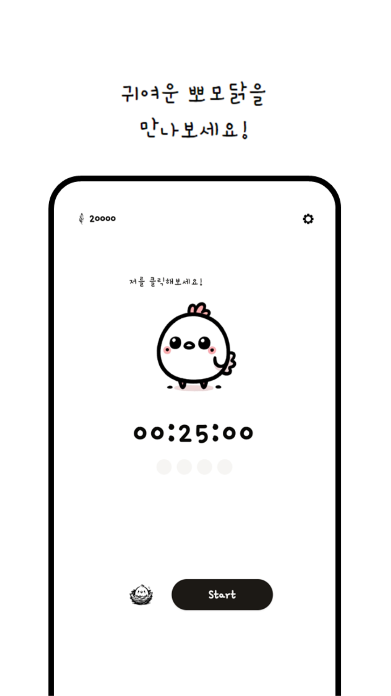
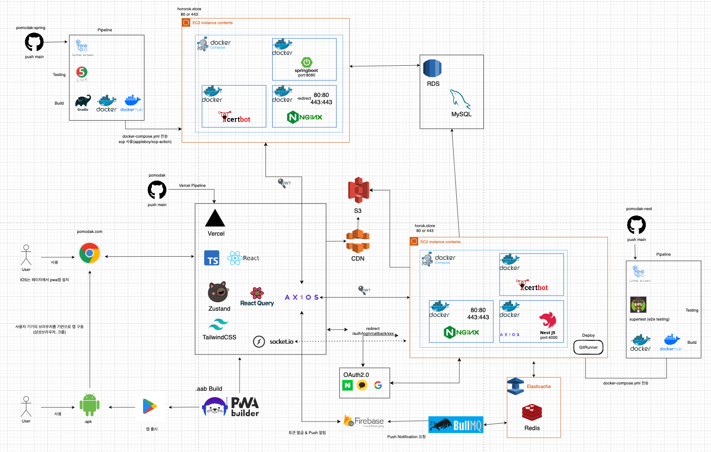

<h1 style="text-align: center;">🐥 뽀모닭: 뽀모도로 타이머</h1>

 

### 🤔기획 의도

> ####

 

### 🎯서비스 대상

 

### 🎨 UI/UX

 

### 📅 기간

> ####

 

## 🔍프로젝트 정보

.. readme 모음

 

### 🛠기술 스택

기술 스택

 

## 프로젝트 특징 및 기능

### 주요 구현 기능

#### 페이지

## 🤝팀 소개

### 🙋‍♂️🙋‍♀️구성원 및 담당 역할

#### 🛰BE

| 이름                                                                      | 개발 내용                                 |
| ------------------------------------------------------------------------- | ----------------------------------------- |
| [👨🏻‍💻 이창우](https://github.com/woo3145) [📧](mailto:lcwoo3145@gmail.com)  | Nest - Timer Server             |
| [👨🏻‍💻 이지선](https://github.com/js1171) [📧](mailto:bhd1171@naver.com)     | Spring Boot - Contents Server   |
| [👩🏻‍💻 노혜지](https://github.com/HyeJiRoh) [📧](mailto:shgpwl509@naver.com) | Spring Boot - Contents Server   |

#### 🌈FE

| 이름                                                                     | 개발 내용                                |
| ------------------------------------------------------------------------ | ---------------------------------------- |
| [👨🏻‍💻 이창우](https://github.com/woo3145) [📧](mailto:lcwoo3145@gmail.com) | React, TypeScript, Socket.io   |

### ⚙팀 운영

|    노션    |    Jira    |    Git     |
| :--------: | :--------: | :--------: |
|  |  |  |
|   내용1    |   내용2    |   내용3    |

### ✒프로젝트 회고

#### 이창우

> 회고

#### 이지선

> 회고

#### 노혜지

> 회고
