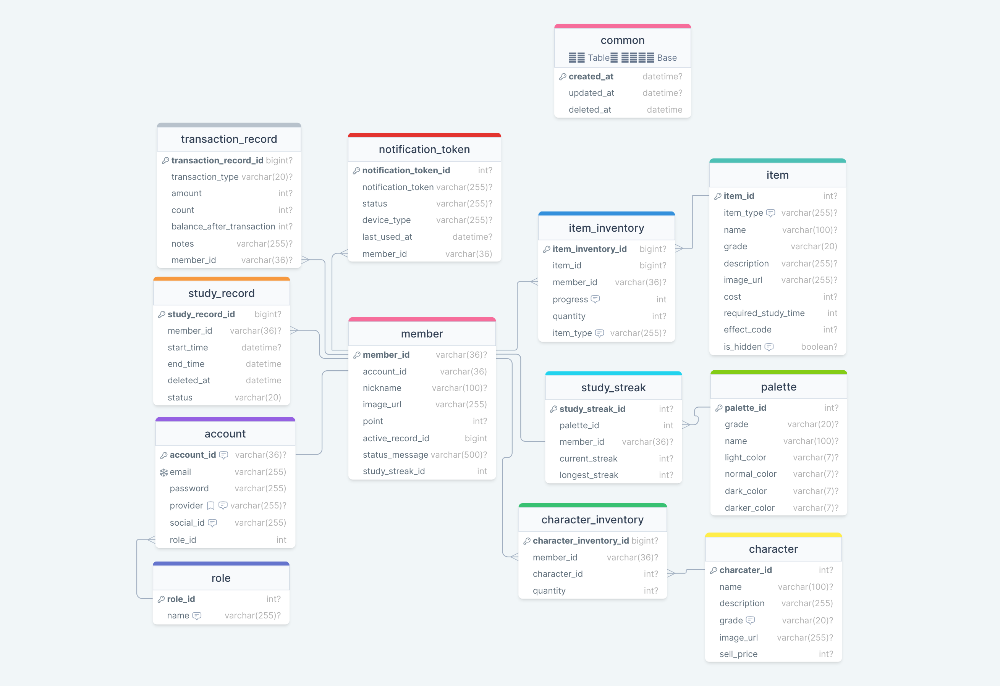

<h1 align= "center">🐥 뽀모닭: 뽀모도로 타이머</h1>

 

- 서비스 URL : https://pomodak.com
- 플레이 스토어 : 비공개 테스트 심사중

  

# 프로젝트 소개

---
### 💡뽀모도로 / 포커스 / 집중 타이머 + 귀여운 캐릭터 수집

 

### 뽀모도로 기법이란?
타이머를 이용해 25분간 집중한 후 5분 휴식하는 시간 관리 방법

 

### 뽀모닭의 다양한 기능

1. 타이머 기능 선택
   - 0부터 시작하는 '기본 타이머'와 집중력을 높일 수 있는 '뽀모도로 타이머'
   - 원하는 모드를 선택하여 나의 시간에 집중해보세요 

2. 나의 기록 되돌아 보기
   - 스터디 기록을 시간과 색깔 스트릭으로 확인할 수 있어요
   

3. 동료가 필요할 땐 함께 공부하기
   - 함께 공부하기 모드를 통하여 **최대 9명의 동료가 함께 스터디**를 할 수 있어요
   - 다른 동료의 스터디 시간으로 보며 동기부여 UP!
   

4. 학습 후엔 캐릭터 보상
   - 공부에 재미와 동기부여를 더해줄 캐릭터 보상!
   - 일정 공부 시간이 지나면 뽀모닭의 **다양한 닭 캐릭터를 수집**할 수 있어요

  

# 팀원 구성

---

|                                              **이창우** [📧](mailto:lcwoo3145@gmail.com)                                               |                                              **이지선** [📧](mailto:bhd1171@naver.com)                                               |                                               **노혜지** [📧](mailto:shgpwl509@naver.com)                                               |
|:-----------------------------------------------------------------------------------------------------------------------------------:|:---------------------------------------------------------------------------------------------------------------------------------:|:------------------------------------------------------------------------------------------------------------------------------------:|
| [   @woo3145](https://github.com/woo3145) | [   @js1171](https://github.com/js1171) | [   @HyeJiRho](https://github.com/HyeJiRoh) |
|                                                           FE / BE (Nest)                                                            |                                                            BE (Spring)                                                            |                                                             BE (Spring)                                                              |

  

# 🎨 UI/UX

---
[디자인 변화 과정](https://woo3145.com/blog/pomodak-dev-story-1) 포스팅

  

# 🛠 Tech & Architecture

---
#### 전체 구성

 

### [FE](https://github.com/pomodak/pomodak)

- `React`(18.2.x), `tailwind`, `zustand`, `react-query`
- Infrastructure: `axios`, `firebase(fcm)`
- CI/CD: `vercel`
- Build: `vite`, `vite-plugin-pwa`, `pwa-builder`

### [BE (Nest)](https://github.com/pomodak/pomodak-nest)

- `Nest`(10.0.x)
- Infrastructure: `axios`, `redis`(elastiCache),`mysql8.0(aws-rds)`(dev, prod), `firebase-admin`, `nodemailer`
- CI/CD: `ec2`, `docker`, `docker-compose`, `github-actions`, `git-runner`

### [BE (Spring)](https://github.com/pomodak/pomodak-spring)

- `Spring boot`(3.2.x)
- Infrastructure: `mysql8.0(aws-rds)`(dev, prod)
- CI/CD: `ec2`, `docker`, `docker-compose`, `github-actions`, `scp`

  

# 🎨 ERD

---

  

# 📅 기간

---
- **개발(1.0.0) :** 2024/1/10 ~ 3/18
- **플레이 스토어 비공개 테스트 :** 2024/3/18 ~ 진행중

  

# 🔍프로젝트 정보

---
뽀모닭 서비스는 **앱 출시 및 실서비스**를 목적으로 제작된 프로젝트입니다.  
실서비스를 하기 위해 `아이디어, 재미, 안정성`이 가장 중요하다고 판단하였습니다.   

1. 아래와 같은 이유로 초기에 CI/CD를 구축하여 애자일 방법론을 통해 개발을 진행
   - node 풀스택 1 + spring 2로 구성된 소규모 팀
   - 여러 재미있는 아이디어를 시험하고 테스트하기 위해
   - 사용자의 입장에서 빠르게 테스트해보고 재미있는지 판단하기 위해
   - `PWA(Progressive Web App)`이지만 완전한 네이티브 앱처럼 동작하기 위해
   - 불편을 느낄 수 있는 버그에 빠르게 대응하기 위해
   

2. 팀원의 기술 스택을 고려하여 아래와 같이 역할을 분리
   - `react` : 빠르게 개발하고 SPA로 네이티브 앱과 가장 비슷하게 동작
   - `nest` : 타이머, 실시간 통신 및 fcm을 처리
   - `spring` : 캐릭터와 뽑기 등의 컨텐츠를 제공하고 관리 

3. 컨텐츠 제작
   - 모든 컨텐츠 이미지는 AI와 각종 툴, 그림판으로 제작

4. 계획
   - 현재 테스트 기간이라 꾸준한 버전업을 통해 앱을 개선
   - 안정적인 운영을 위해 로깅과 모니터링 시스템을 구축하고 있음

  

# 프로젝트 특징 및 기능

---
### 주요 구현 기능

인증

1. https 통신 구현
   - **프리티어의 장점**을 살리기 위해 `nest`와 `spring`서버 각각 다른 계정의 `ec2`에서 배포
   - 각 서버에 cerbot을 사용한 ssl 인증서 자동 발급을 구현하여 https 통신 구현

2. 사용자 식별
   - `nest` 서버에 `JWT 기반`의 인증 시스템을 구축하고 `OAuth` 계정을 통합
   - `jwt secretKey` 공유를 통해 각 서버의 가드에서 인증된 사용자를 식별할 수 있도록 구현

3. 로그인 방식 변경
   - 기존 방식 : `로그인을 하지 않으면 리다이렉션을 통해 앱에 접근할 수 없는 방식`
   - 변경 방식 : `기능 제한을 통한 로그인 유도 방식` (애드센스 심사를 위함)

- 이메일 회원가입(메일링)
- 이메일 로그인
- 패스워드 찾기(메일링)
- OAuth 로그인

타이머 모드

1. 일반 모드 
   - 0부터 시작하여, Give up 버튼을 누를 때 공부 시간을 기록

2. 뽀모도로 모드
   - 설정한 시간 부터 0까지 줄어 들고 0이 되었을 때 공부 시간 기록
     - 앱이 포그라운드 상태면 인앱 진동 알림이 울림
     - 백그라운드 상태면 fcm을 통해 예약된 푸시 알림이 발송

아이템 구매, 캐릭터 판매

캐릭터/스트릭 팔레트 뽑기

함께 공부하기

푸시 알림

캘린더/스트릭 통계

#### 페이지

# ⚙팀 운영

---
|    노션    |    Jira    |    Git     |
| :--------: | :--------: | :--------: |
|  |  |  |
|   내용1    |   내용2    |   내용3    |

  

# ✒ 프로젝트 회고

---
### 이창우

> 회고

### 이지선

> 회고

### 노혜지

> 회고
