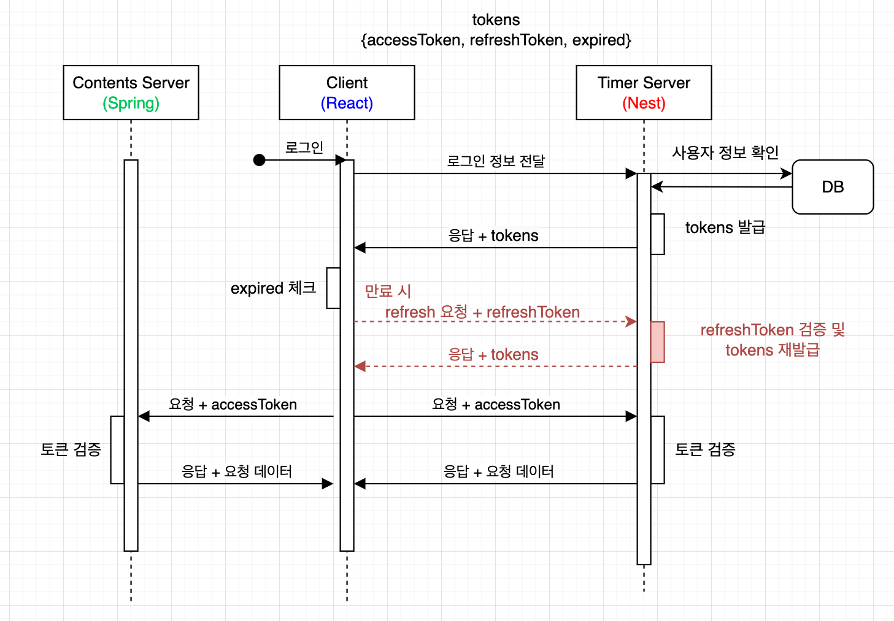
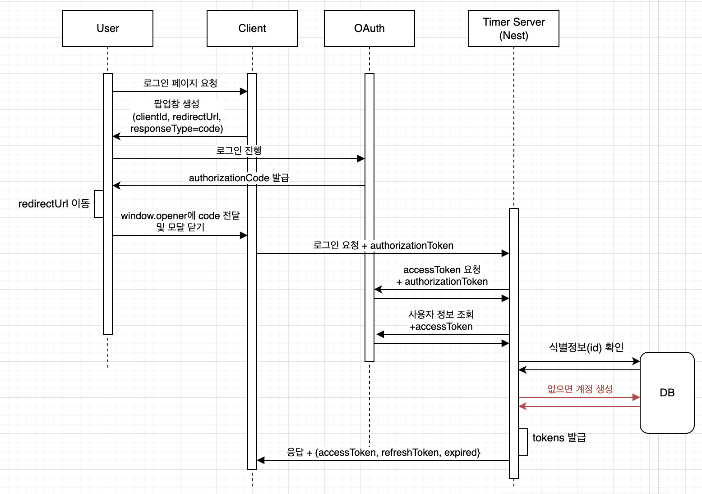

## 인증

1. 사용자 식별
   - `nest` 서버에 `JWT 기반`의 인증 시스템을 구축하고 `OAuth` 계정을 통합
   - `jwt secretKey` 공유를 통해 각 서버의 가드에서 인증된 사용자를 식별할 수 있도록 구현

2. 메인 컨텐츠 접근
   - 방식 변경
     - 기존 방식 : `로그인을 하지 않으면 리다이렉션을 통해 앱에 접근할 수 없는 방식`
     - 변경 방식 : `기능 제한을 통한 로그인 유도 방식` 
   - 이유
     - 애드센스 심사를 위해 크롤링봇이 내부 컨텐츠를 인식할 수 있도록 수정
     - 추후 오프라인 모드까지 확장 시키기 위해

3. 이메일 회원가입/로그인 방식 변경
   - 방식 변경
     - 기존 방식 : `이메일 확인 없이 즉시 가입`
     - 변경 방식 : `redis에 5분뒤 만료되는 코드를 저장하고, 메일 발송을 통해 소유 확인`
   - 이유
     - 무분별한 가입 방지
     - 패스워드 찾기 기능을 추가하기 위해

##### 인증 플로우
각 서버의 axios 인스턴스(`nestHttpRequest`, `springHttpRequest`)에서 expired를 확인하고 만료시 `Nest`에 리프레시를 진행하는 인터셉터 등록

##### OAuth 플로우
