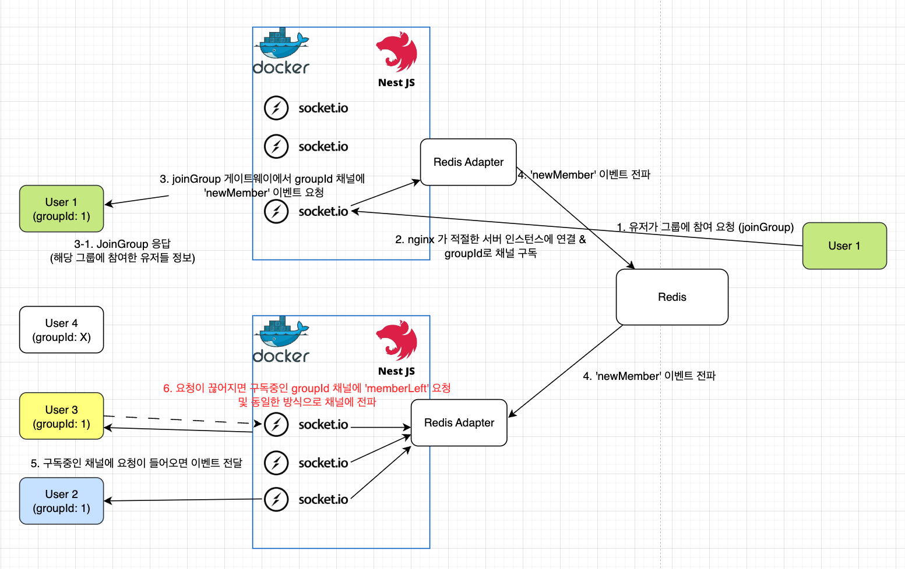

## 함께 공부하기 기능(소켓 통신)

[study-group.gateway.ts](https://github.com/pomodak/pomodak-nest/blob/main/apps/timer-app/src/study-timer/study-group.gateway.ts)
[study-group.service.ts](https://github.com/pomodak/pomodak-nest/blob/main/apps/timer-app/src/study-timer/study-group-redis.service.ts)

0. 고려 사항

- Redis를 통한 [Pub/Sub Adapter](https://github.com/pomodak/pomodak-nest/blob/main/apps/timer-app/src/redis/redis-io.adapter.ts) 구현

  - 스케일업을 위해 도커로 여러개의 서버 인스턴스를 올리면 각 인스턴스끼리 소켓통신이 안되기 때문에
    redis adapter를 통해 다른 서버 인스턴스 끼리도 소켓 연결이 되도록 구현하였습니다.

- Redis를 사용하여 그룹의 상태, 멤버 정보 등을 관리

  ```ts
  // (string)  group:{groupId}:count      - 현재 그룹 인원 (number)
  // (set)     group:{groupId}:members    - 그룹에 참여중인 멤버의 id 배열 (string[])
  // (string)  member:{memberId}:group   - 해당 멤버가 참여중인 그룹
  // (hash)    member:{memberId}          - 멤버정보(MemberInfo)
  ```

- UI에 관련하여 하나의 그룹을 최대 9으로 구성 하였고 Redis에 저장된 데이터를 바탕으로 그룹 참여

  ```ts
  // maxGroupMembers명 미만인 그룹 찾기
  async findAvailableGroup(maxGroupMembers: number): Promise<string | null> {
      const groupCounts = await this.redis.keys('group:*:count');
      for (const countKey of groupCounts) {
      const membersCount = await this.redis.get(countKey);
      if (membersCount && parseInt(membersCount, 10) < maxGroupMembers) {
          // 'group:xyz:count'에서 'xyz'를 추출
          return countKey.split(':')[1];
        }
      }
      return null;
  }
  ```

## Flow

플로우를 도면화 시키면 다음과 같습니다.



추후 고유 groupId 참여를 통해 원하는 유저와 연결할 수 있는 기능을 추가할 예정입니다.
