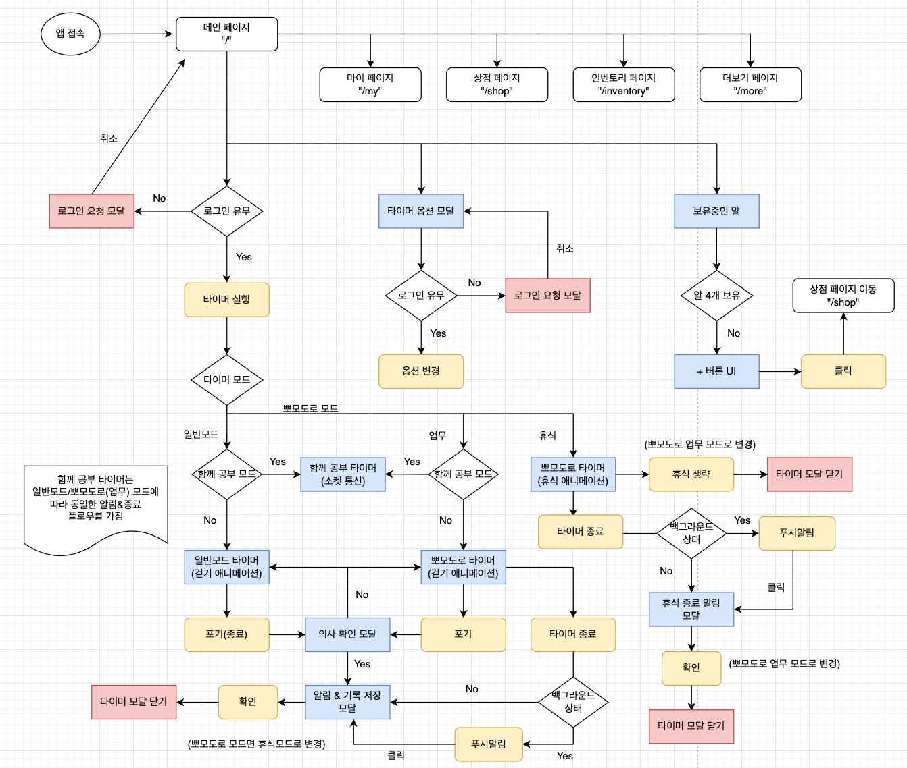

### 타이머 & 푸시 알림 기능

0. 고려 사항

   - `이벤트 루프`를 통한 구현은 `백그라운드`에 갔을 때 `cpu를 자주 할당받지 못하여` `시간 오차`가 많이 발생

     - `시작 시간을 기록 후` 타이머 진행 로직을 `시작 시간과의 차이를 통해 계산`하도록 수정 후 백그라운드에서는 타이머 정지

   - 위에서 해결한 방식은 `포그라운드`에서만 타이머 진행 사항과 종료 여부를 알 수 있음
     - `백그라운드`로 전환될때 `fcm 메세지 예약`, `포그라운드`로 전활될 때 `fcm 메세지 취소` 로직을 구현하여 `백그라운드`에서도 정확한 종료 시간에 알림을 받아 앱으로 돌아올 수 있도록 함

1. 일반 모드

   - 0부터 시작하여, Give up 버튼을 누를 때 공부 시간을 기록

2. 뽀모도로 모드

   - 뽀모도로 모드 켜기면 알림 허용 여부를 파악하여 토큰 저장 (거부 시 알림 허용 안내)
   - 설정한 시간 부터 0까지 줄어 들고 0이 되었을 때 공부 시간 기록
     - 앱이 포그라운드 상태면 인앱 진동 알림이 울림
     - 백그라운드 상태면 fcm을 통해 예약된 푸시 알림이 발송
   - 각 모드(업무, 휴식)에 맞는 `진행 모션`, `알람 모달` 존재
   - 업무모드와 휴식모드가 번갈아가며 진행되고 `목표 세션을 모두 채우면 최종 알람 모달`

3. 푸시 알림

   - fcm 메세지 예약 & 취소 구현
   - 안정적인 처리를 위해 메세지큐(bull)을 사용
   - 취소를 위해 유저에게 예약된 타이머 이벤트 id를 redis를 이용하여 저장

##### 타이머 플로우

