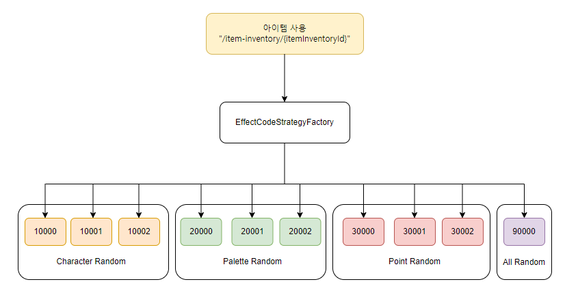

# 아이템 사용 기능

 

## 고려 사항

- 아이템별 효과 차이
  - Effect Code별 기능 구현
  - item에 해당하는 Effect Code 적용 (같은 효과인 경우 같은 Effect Code 사용)

- 지속적인 아이템 추가 예상 
  - 유지보수, 확장성 고려하여 팩토리 패턴 적용
  - 새로운 아이템 추가시 새로운 Effect Code 클래스 생성하여 기능 구현

 

## Flow

1. 아이템 사용 API 요청 ("/item-inventory/{itemInventoryId}")
    - jwt 검증하여 멤버와 가지고 있는 item 확인

2. 공통 체크 사항

    - 보유하고 있는 아이템인가
    - 사용할 수 있는 수량이 남아있는가

3. Effect Code별 전략에 따라 동작

    - EffectCodeStrategyFactory 통해 아이템의 Effect 코드 전략으로 넘어감
      - 효과에 따라 10000 ~ 99999 (Effect Code) 존재
    - 현재 Effect Code 기준
      - 10000번대 : Character Random 뽑기
      - 20000번대 : Palette Random 뽑기
      - 30000번대 : Point / PointBox Random 뽑기
      - 90000번대 : All(Character, Palette, Point) Random 뽑기

 

## 아이템 사용 Flow

